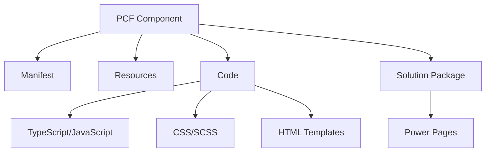

# Advanced PCFs for Power Pages
## Detailed Presentation Outline with Code Examples

---

## 1. Introduction to PCFs in Power Pages (3 minutes)

### 1.1 What are PCFs and Why Use Them in Power Pages?
- Definition and purpose
- Benefits over standard Power Pages components
- Use cases specific to Power Pages

### 1.2 PCF Architecture Overview


---

## 2. Basic Integration Methods (8 minutes)

### 2.1 Form Embedding from Model-Driven Apps
- How model-driven forms work in Power Pages
- Integration process overview

#### Sample Code: Basic Form Embedding
```html
<!-- Power Pages Template -->
<div id="formContainer">
  
</div>
```

```javascript
// Power Pages JavaScript
document.addEventListener('DOMContentLoaded', function() {
  // Access the embedded form
  const formContext = Xrm.Page;
  
  // Example: Hide a section based on a condition
  formContext.ui.tabs.get("general").sections.get("address").setVisible(false);
});
```

### 2.2 Limitations of Form Embedding
- Limited customization options
- Performance considerations
- Styling constraints
- Version compatibility issues

#### Sample Code: Form Embedding Limitations
```javascript
// This won't work as expected in embedded forms
// because of sandbox limitations
try {
  // Attempting to access window.parent can cause issues
  window.parent.postMessage({ type: "formData", data: formData }, "*");
} catch (e) {
  console.error("Cross-frame access denied:", e);
}
```

### 2.3 Embedding with Liquid Tagging
- Liquid tag syntax for PCF embedding
- Configuration options

#### Sample Code: Liquid Tag Embedding
```html
{% pcf control="MyNamespace.MyControl" 
   data-property-dataset=entities.contact 
   data-property-primaryfield="fullname" 
   data-property-additionalfields="emailaddress1,telephone1" 
   width="100%" 
   height="400px" %}
```

### 2.4 Limitations of Liquid Tag Embedding
- Data binding constraints
- Context limitations
- Security considerations

#### Sample Code: Liquid Tag Limitations
```html
{% pcf control="MyNamespace.MyControl" 
   data-property-dataset=entities.contact 
   width="100%" %}
   
<!-- The following would not work as expected -->
<!-- Cannot directly access current user context -->
<!-- data-property-currentuser=user -->
```

---

## 3. Advanced PCF Development for Power Pages (8 minutes)

### 3.1 Building & Packaging Strategies

#### 3.1.1 Virtual vs. Vanilla PCF
- Architectural differences
- Use case considerations

##### Sample Code: Virtual PCF
```typescript
// Virtual PCF component
export class VirtualControl implements ComponentFramework.StandardControl<IInputs, IOutputs> {
    private _container: HTMLDivElement;
    private _context: ComponentFramework.Context<IInputs>;
    private _notifyOutputChanged: () => void;
    
    public init(context: ComponentFramework.Context<IInputs>, notifyOutputChanged: () => void): void {
        this._context = context;
        this._notifyOutputChanged = notifyOutputChanged;
        this._container = document.createElement("div");
        
        // Virtual controls don't have a direct visual representation
        // They typically manipulate other elements or provide services
    }
    
    public updateView(context: ComponentFramework.Context<IInputs>): void {
        // Update logic without direct UI manipulation
    }
    
    public getOutputs(): IOutputs {
        return {};
    }
    
    public destroy(): void {
        // Cleanup
    }
}
```

##### Sample Code: Vanilla PCF
```typescript
// Vanilla PCF component
export class StandardControl implements ComponentFramework.StandardControl<IInputs, IOutputs> {
    private _container: HTMLDivElement;
    private _context: ComponentFramework.Context<IInputs>;
    private _notifyOutputChanged: () => void;
    private _value: string;
    
    public init(context: ComponentFramework.Context<IInputs>, notifyOutputChanged: () => void): void {
        this._context = context;
        this._notifyOutputChanged = notifyOutputChanged;
        this._container = document.createElement("div");
        
        // Create UI elements
        const input = document.createElement("input");
        input.type = "text";
        input.addEventListener("change", this._onInputChange);
        this._container.appendChild(input);
        
        // Add to parent container
        context.container.appendChild(this._container);
    }
    
    private _onInputChange = (event: Event): void => {
        this._value = (event.target as HTMLInputElement).value;
        this._notifyOutputChanged();
    }
    
    public updateView(context: ComponentFramework.Context<IInputs>): void {
        // Update UI based on context changes
    }
    
    public getOutputs(): IOutputs {
        return {
            value: this._value
        };
    }
    
    public destroy(): void {
        // Cleanup
    }
}
```

#### 3.1.2 Forcing React Bundling
- Benefits for complex UIs
- Configuration approach

##### Sample Code: React Bundling in PCF
```typescript
// package.json configuration
{
  "name": "my-pcf-control",
  "version": "1.0.0",
  "dependencies": {
    "react": "^17.0.2",
    "react-dom": "^17.0.2"
  },
  "pcfConfig": {
    "bundleStrategy": "react"
  }
}
```

```typescript
// React component in PCF
import * as React from 'react';
import * as ReactDOM from 'react-dom';

interface IProps {
  context: ComponentFramework.Context<IInputs>;
  updateValue: (value: string) => void;
}

const MyReactComponent: React.FC<IProps> = (props) => {
  const [value, setValue] = React.useState("");
  
  const handleChange = (e: React.ChangeEvent<HTMLInputElement>) => {
    const newValue = e.target.value;
    setValue(newValue);
    props.updateValue(newValue);
  };
  
  return (
    <div className="my-component">
      <input 
        type="text" 
        value={value} 
        onChange={handleChange} 
        placeholder="Enter value" 
      />
    </div>
  );
};

export class ReactPCFControl implements ComponentFramework.StandardControl<IInputs, IOutputs> {
  private _container: HTMLDivElement;
  private _context: ComponentFramework.Context<IInputs>;
  private _notifyOutputChanged: () => void;
  private _value: string;
  
  public init(context: ComponentFramework.Context<IInputs>, notifyOutputChanged: () => void): void {
    this._context = context;
    this._notifyOutputChanged = notifyOutputChanged;
    this._container = document.createElement("div");
    context.container.appendChild(this._container);
    
    this._renderControl();
  }
  
  private _renderControl(): void {
    ReactDOM.render(
      <MyReactComponent 
        context={this._context} 
        updateValue={this._updateValue} 
      />,
      this._container
    );
  }
  
  private _updateValue = (value: string): void => {
    this._value = value;
    this._notifyOutputChanged();
  }
  
  public updateView(context: ComponentFramework.Context<IInputs>): void {
    this._renderControl();
  }
  
  public getOutputs(): IOutputs {
    return {
      value: this._value
    };
  }
  
  public destroy(): void {
    ReactDOM.unmountComponentAtNode(this._container);
  }
}
```

#### 3.1.3 Optimizing for Power Pages Context
- Performance considerations
- Loading strategies

##### Sample Code: Optimized Loading
```typescript
// Optimized loading for Power Pages
export class OptimizedControl implements ComponentFramework.StandardControl<IInputs, IOutputs> {
  private _container: HTMLDivElement;
  private _context: ComponentFramework.Context<IInputs>;
  private _resources: string[] = [];
  private _loaded: boolean = false;
  
  public init(context: ComponentFramework.Context<IInputs>, notifyOutputChanged: () => void): void {
    this._context = context;
    this._container = document.createElement("div");
    context.container.appendChild(this._container);
    
    // Show loading indicator
    this._container.innerHTML = '<div class="loading">Loading...</div>';
    
    // Load resources asynchronously
    this._loadResources().then(() => {
      this._loaded = true;
      this._renderControl();
    });
  }
  
  private async _loadResources(): Promise<void> {
    // Load only what's needed
    const cssPromise = new Promise<void>((resolve) => {
      const link = document.createElement('link');
      link.rel = 'stylesheet';
      link.href = this._context.resources.getResource("styles.css");
      link.onload = () => resolve();
      document.head.appendChild(link);
    });
    
    // Load scripts asynchronously
    const scriptPromise = new Promise<void>((resolve) => {
      const script = document.createElement('script');
      script.src = this._context.resources.getResource("bundle.js");
      script.async = true;
      script.onload = () => resolve();
      document.head.appendChild(script);
    });
    
    await Promise.all([cssPromise, scriptPromise]);
  }
  
  private _renderControl(): void {
    if (!this._loaded) return;
    
    // Clear loading indicator
    this._container.innerHTML = '';
    
    // Render optimized control
    // ...
  }
  
  public updateView(context: ComponentFramework.Context<IInputs>): void {
    if (this._loaded) {
      this._renderControl();
    }
  }
  
  public getOutputs(): IOutputs {
    return {};
  }
  
  public destroy(): void {
    // Cleanup
  }
}
```

### 3.2 UI Framework Considerations

#### 3.2.1 Fluent UI vs. Bootstrap
- Comparison of frameworks
- Integration approaches

##### Sample Code: Fluent UI Implementation
```typescript
// Fluent UI in PCF
import * as React from 'react';
import * as ReactDOM from 'react-dom';
import { PrimaryButton, TextField, Stack, IStackTokens } from '@fluentui/react';

const stackTokens: IStackTokens = { childrenGap: 10 };

const FluentComponent: React.FC = () => {
  const [value, setValue] = React.useState("");
  
  return (
    <Stack tokens={stackTokens}>
      <TextField 
        label="Enter value" 
        value={value} 
        onChange={(e, newValue) => setValue(newValue || "")} 
      />
      <PrimaryButton 
        text="Submit" 
        onClick={() => console.log(value)} 
      />
    </Stack>
  );
};

export class FluentUIControl implements ComponentFramework.StandardControl<IInputs, IOutputs> {
  private _container: HTMLDivElement;
  
  public init(context: ComponentFramework.Context<IInputs>, notifyOutputChanged: () => void): void {
    this._container = document.createElement("div");
    context.container.appendChild(this._container);
    
    ReactDOM.render(<FluentComponent />, this._container);
  }
  
  // Other required methods...
}
```

##### Sample Code: Bootstrap Implementation
```typescript
// Bootstrap in PCF
import * as React from 'react';
import * as ReactDOM from 'react-dom';
import 'bootstrap/dist/css/bootstrap.min.css';

const BootstrapComponent: React.FC = () => {
  const [value, setValue] = React.useState("");
  
  return (
    <div className="container">
      <div className="form-group">
        <label htmlFor="inputValue">Enter value</label>
        <input 
          type="text" 
          className="form-control" 
          id="inputValue" 
          value={value} 
          onChange={(e) => setValue(e.target.value)} 
        />
      </div>
      <button 
        className="btn btn-primary" 
        onClick={() => console.log(value)}
      >
        Submit
      </button>
    </div>
  );
};

export class BootstrapControl implements ComponentFramework.StandardControl<IInputs, IOutputs> {
  private _container: HTMLDivElement;
  
  public init(context: ComponentFramework.Context<IInputs>, notifyOutputChanged: () => void): void {
    this._container = document.createElement("div");
    context.container.appendChild(this._container);
    
    ReactDOM.render(<BootstrapComponent />, this._container);
  }
  
  // Other required methods...
}
```

#### 3.2.2 Responsive Design Patterns
- Mobile-first approach
- Adaptive layouts

##### Sample Code: Responsive PCF
```typescript
// Responsive design in PCF
import * as React from 'react';
import * as ReactDOM from 'react-dom';
import './responsive.css';

const ResponsiveComponent: React.FC = () => {
  const [windowWidth, setWindowWidth] = React.useState(window.innerWidth);
  
  React.useEffect(() => {
    const handleResize = () => setWindowWidth(window.innerWidth);
    window.addEventListener('resize', handleResize);
    return () => window.removeEventListener('resize', handleResize);
  }, []);
  
  const isMobile = windowWidth < 768;
  
  return (
    <div className={`container ${isMobile ? 'mobile' : 'desktop'}`}>
      {isMobile ? (
        <div className="mobile-layout">
          {/* Mobile-specific layout */}
          <div className="stacked-controls">
            <input type="text" className="form-control" placeholder="Search" />
            <button className="btn btn-primary btn-block">Submit</button>
          </div>
        </div>
      ) : (
        <div className="desktop-layout">
          {/* Desktop-specific layout */}
          <div className="horizontal-controls">
            <input type="text" className="form-control" placeholder="Search" />
            <button className="btn btn-primary">Submit</button>
          </div>
        </div>
      )}
    </div>
  );
};

// CSS file (responsive.css)
/*
.mobile .stacked-controls {
  display: flex;
  flex-direction: column;
  gap: 10px;
}

.desktop .horizontal-controls {
  display: flex;
  align-items: center;
  gap: 10px;
}

.mobile .btn-block {
  width: 100%;
}
*/
```

#### 3.2.3 Accessibility Considerations
- WCAG compliance
- Keyboard navigation
- Screen reader support

##### Sample Code: Accessible PCF
```typescript
// Accessible PCF component
import * as React from 'react';
import * as ReactDOM from 'react-dom';

const AccessibleComponent: React.FC = () => {
  const [isOpen, setIsOpen] = React.useState(false);
  const [selectedOption, setSelectedOption] = React.useState("");
  const dropdownRef = React.useRef<HTMLDivElement>(null);
  
  // Handle keyboard navigation
  const handleKeyDown = (e: React.KeyboardEvent) => {
    if (e.key === "Enter" || e.key === " ") {
      setIsOpen(!isOpen);
      e.preventDefault();
    } else if (e.key === "Escape" && isOpen) {
      setIsOpen(false);
    }
  };
  
  // Close dropdown when clicking outside
  React.useEffect(() => {
    const handleClickOutside = (event: MouseEvent) => {
      if (dropdownRef.current && !dropdownRef.current.contains(event.target as Node)) {
        setIsOpen(false);
      }
    };
    
    document.addEventListener("mousedown", handleClickOutside);
    return () => document.removeEventListener("mousedown", handleClickOutside);
  }, []);
  
  return (
    <div 
      ref={dropdownRef}
      className="accessible-dropdown"
      role="combobox"
      aria-expanded={isOpen}
      aria-haspopup="listbox"
      aria-labelledby="dropdown-label"
    >
      <label id="dropdown-label" htmlFor="dropdown-button">Select an option</label>
      <button
        id="dropdown-button"
        aria-expanded={isOpen}
        onClick={() => setIsOpen(!isOpen)}
        onKeyDown={handleKeyDown}
      >
        {selectedOption || "Choose..."}
      </button>
      
      {isOpen && (
        <ul role="listbox" aria-labelledby="dropdown-label">
          {["Option 1", "Option 2", "Option 3"].map((option) => (
            <li
              key={option}
              role="option"
              aria-selected={selectedOption === option}
              tabIndex={0}
              onClick={() => {
                setSelectedOption(option);
                setIsOpen(false);
              }}
              onKeyDown={(e) => {
                if (e.key === "Enter" || e.key === " ") {
                  setSelectedOption(option);
                  setIsOpen(false);
                  e.preventDefault();
                }
              }}
            >
              {option}
            </li>
          ))}
        </ul>
      )}
    </div>
  );
};
```

---

## 4. Overcoming Common Limitations (10 minutes)

### 4.1 Data Access Strategies
- Working with WebAPI
- Batch operations
- Caching strategies

#### Sample Code: Advanced Data Access
```typescript
// Advanced data access in PCF
export class DataAccessControl implements ComponentFramework.StandardControl<IInputs, IOutputs> {
  private _container: HTMLDivElement;
  private _context: ComponentFramework.Context<IInputs>;
  private _cache: Map<string, any> = new Map();
  
  public init(context: ComponentFramework.Context<IInputs>, notifyOutputChanged: () => void): void {
    this._context = context;
    this._container = document.createElement("div");
    context.container.appendChild(this._container);
    
    this._loadData();
  }
  
  private async _loadData(): Promise<void> {
    try {
      // Check cache first
      const cacheKey = "contacts_recent";
      if (this._cache.has(cacheKey)) {
        this._renderData(this._cache.get(cacheKey));
        return;
      }
      
      // Prepare batch request
      const batch = {
        requests: [
          {
            id: "1",
            method: "GET",
            url: "contacts?$select=contactid,fullname,emailaddress1&$top=10&$orderby=createdon desc"
          },
          {
            id: "2",
            method: "GET",
            url: "accounts?$select=accountid,name&$top=5&$orderby=createdon desc"
          }
        ]
      };
      
      // Execute batch request
      const response = await fetch(`${this._context.page.getClientUrl()}/api/data/v9.1/$batch`, {
        method: "POST",
        headers: {
          "Content-Type": "application/json",
          "Accept": "application/json",
          "OData-MaxVersion": "4.0",
          "OData-Version": "4.0"
        },
        body: JSON.stringify(batch)
      });
      
      const batchResponse = await response.json();
      
      // Process responses
      const contacts = batchResponse.responses[0].body.value;
      
      // Cache the results (with 5 minute expiration)
      this._cache.set(cacheKey, contacts);
      setTimeout(() => this._cache.delete(cacheKey), 5 * 60 * 1000);
      
      // Render the data
      this._renderData(contacts);
    } catch (error) {
      console.error("Error loading data:", error);
      this._container.innerHTML = `<div class="error">Error loading data</div>`;
    }
  }
  
  private _renderData(data: any[]): void {
    // Render the data...
  }
  
  // Other required methods...
}
```

### 4.2 Authentication & Security Challenges
- Handling authentication context
- Security best practices

#### Sample Code: Authentication Handling
```typescript
// Authentication handling in PCF
export class SecureControl implements ComponentFramework.StandardControl<IInputs, IOutputs> {
  private _container: HTMLDivElement;
  private _context: ComponentFramework.Context<IInputs>;
  
  public init(context: ComponentFramework.Context<IInputs>, notifyOutputChanged: () => void): void {
    this._context = context;
    this._container = document.createElement("div");
    context.container.appendChild(this._container);
    
    this._checkAuthentication();
  }
  
  private async _checkAuthentication(): Promise<void> {
    try {
      // Get current user information
      const userSettings = this._context.userSettings;
      
      // Check if user has necessary privileges
      const hasPrivilege = userSettings.security.privileges.some(
        p => p.name === "prvReadContact"
      );
      
      if (!hasPrivilege) {
        this._container.innerHTML = `
          <div class="error">
            You don't have permission to view this data.
          </div>
        `;
        return;
      }
      
      // For external API calls, get authentication token
      // Note: This is a simplified example
      const response = await fetch(`${this._context.page.getClientUrl()}/api/data/v9.1/WhoAmI`, {
        method: "GET",
        headers: {
          "Accept": "application/json",
          "OData-MaxVersion": "4.0",
          "OData-Version": "4.0"
        }
      });
      
      if (!response.ok) {
        throw new Error("Authentication failed");
      }
      
      // Proceed with authenticated operations
      this._loadSecureData();
    } catch (error) {
      console.error("Authentication error:", error);
      this._container.innerHTML = `
        <div class="error">
          Authentication error. Please refresh the page and try again.
        </div>
      `;
    }
  }
  
  private async _loadSecureData(): Promise<void> {
    // Load data with proper authentication...
  }
  
  // Other required methods...
}
```

### 4.3 Performance Optimization
- Lazy loading
- Virtualization
- Debouncing and throttling

#### Sample Code: Performance Optimized PCF
```typescript
// Performance optimized PCF
import * as React from 'react';
import * as ReactDOM from 'react-dom';

// Utility function for debouncing
const debounce = (fn: Function, delay: number) => {
  let timeoutId: number;
  return (...args: any[]) => {
    clearTimeout(timeoutId);
    timeoutId = window.setTimeout(() => fn(...args), delay);
  };
};

// Virtualized list component
const VirtualizedList: React.FC<{items: any[]}> = ({ items }) => {
  const [visibleRange, setVisibleRange] = React.useState({ start: 0, end: 20 });
  const containerRef = React.useRef<HTMLDivElement>(null);
  
  const updateVisibleRange = () => {
    if (!containerRef.current) return;
    
    const container = containerRef.current;
    const scrollTop = container.scrollTop;
    const height = container.clientHeight;
    
    // Assuming each item is 40px tall
    const itemHeight = 40;
    const visibleItems = Math.ceil(height / itemHeight);
    const buffer = Math.floor(visibleItems / 2);
    
    const start = Math.max(0, Math.floor(scrollTop / itemHeight) - buffer);
    const end = Math.min(items.length, start + visibleItems + buffer * 2);
    
    setVisibleRange({ start, end });
  };
  
  // Debounced scroll handler
  const handleScroll = React.useMemo(
    () => debounce(updateVisibleRange, 100),
    [items.length]
  );
  
  React.useEffect(() => {
    const container = containerRef.current;
    if (container) {
      container.addEventListener('scroll', handleScroll);
      updateVisibleRange();
      return () => container.removeEventListener('scroll', handleScroll);
    }
  }, [handleScroll]);
  
  // Calculate total height to maintain scrollbar
  const totalHeight = items.length * 40;
  
  // Calculate offset for visible items
  const offsetY = visibleRange.start * 40;
  
  return (
    <div 
      ref={containerRef}
      style={{ height: '400px', overflow: 'auto' }}
    >
      <div style={{ height: `${totalHeight}px`, position: 'relative' }}>
        <div style={{ position: 'absolute', top: `${offsetY}px`, width: '100%' }}>
          {items.slice(visibleRange.start, visibleRange.end).map((item, index) => (
            <div 
              key={visibleRange.start + index} 
              style={{ height: '40px', padding: '10px', borderBottom: '1px solid #eee' }}
            >
              {item.name}
            </div>
          ))}
        
        </div>
      </div>
    </div>
  );
};

export class OptimizedListControl implements ComponentFramework.StandardControl<IInputs, IOutputs> {
  private _container: HTMLDivElement;
  private _items: any[] = [];
  
  public init(context: ComponentFramework.Context<IInputs>, notifyOutputChanged: () => void): void {
    this._container = document.createElement("div");
    context.container.appendChild(this._container);
    
    // Generate sample data
    this._items = Array.from({ length: 10000 }, (_, i) => ({
      id: i,
      name: `Item ${i}`,
      description: `Description for item ${i}`
    }));
    
    this._renderControl();
  }
  
  private _renderControl(): void {
    ReactDOM.render(
      <VirtualizedList items={this._items} />,
      this._container
    );
  }
  
  // Other required methods...
}
```

### 4.4 Browser Compatibility Issues
- Cross-browser testing
- Polyfills and fallbacks

#### Sample Code: Browser Compatibility
```typescript
// Browser compatibility handling
export class CompatibleControl implements ComponentFramework.StandardControl<IInputs, IOutputs> {
  private _container: HTMLDivElement;
  private _context: ComponentFramework.Context<IInputs>;
  
  public init(context: ComponentFramework.Context<IInputs>, notifyOutputChanged: () => void): void {
    this._context = context;
    this._container = document.createElement("div");
    context.container.appendChild(this._container);
    
    this._loadPolyfills().then(() => this._renderControl());
  }
  
  private async _loadPolyfills(): Promise<void> {
    // Check for required features and load polyfills if needed
    const promises: Promise<void>[] = [];
    
    // Example: Check for IntersectionObserver support
    if (!('IntersectionObserver' in window)) {
      promises.push(
        new Promise<void>((resolve) => {
          const script = document.createElement('script');
          script.src = 'https://polyfill.io/v3/polyfill.min.js?features=IntersectionObserver';
          script.onload = () => resolve();
          document.head.appendChild(script);
        })
      );
    }
    
    // Example: Check for fetch support
    if (!('fetch' in window)) {
      promises.push(
        new Promise<void>((resolve) => {
          const script = document.createElement('script');
          script.src = 'https://polyfill.io/v3/polyfill.min.js?features=fetch';
          script.onload = () => resolve();
          document.head.appendChild(script);
        })
      );
    }
    
    await Promise.all(promises);
  }
  
  private _renderControl(): void {
    // Detect browser
    const userAgent = navigator.userAgent;
    const isIE = /MSIE|Trident/.test(userAgent);
    
    if (isIE) {
      // Render simplified version for IE
      this._container.innerHTML = `
        <div class="legacy-browser">
          <div class="simple-control">
            <input type="text" class="simple-input" />
            <button class="simple-button">Submit</button>
          </div>
          <p class="browser-notice">
            You're using Internet Explorer. For the best experience, 
            please use a modern browser like Edge, Chrome, or Firefox.
          </p>
        </div>
      `;
    } else {
      // Render full-featured control for modern browsers
      // ...
    }
  }
  
  // Other required methods...
}
```

---

## 5. Integration Patterns (5 minutes)

### 5.1 Communicating with Other Page Elements
- PostMessage API
- Custom events

#### Sample Code: Cross-Component Communication
```typescript
// PCF communicating with other page elements
export class CommunicatingControl implements ComponentFramework.StandardControl<IInputs, IOutputs> {
  private _container: HTMLDivElement;
  private _context: ComponentFramework.Context<IInputs>;
  private _value: string;
  private _notifyOutputChanged: () => void;
  
  public init(context: ComponentFramework.Context<IInputs>, notifyOutputChanged: () => void): void {
    this._context = context;
    this._notifyOutputChanged = notifyOutputChanged;
    this._container = document.createElement("div");
    context.container.appendChild(this._container);
    
    // Create UI
    const button = document.createElement("button");
    button.textContent = "Send Message";
    button.addEventListener("click", this._sendMessage);
    this._container.appendChild(button);
    
    // Listen for messages from other components
    window.addEventListener("message", this._handleMessage);
    
    // Listen for custom events
    document.addEventListener("custom:dataUpdate", this._handleCustomEvent as EventListener);
  }
  
  private _sendMessage = (): void => {
    // Send message to parent window
    window.parent.postMessage({
      type: "PCF_DATA_UPDATE",
      data: { value: "Updated value" }
    }, "*");
    
    // Dispatch custom event
    const event = new CustomEvent("custom:pcfAction", {
      detail: { action: "update", value: "Updated value" },
      bubbles: true
    });
    this._container.dispatchEvent(event);
  }
  
  private _handleMessage = (event: MessageEvent): void => {
    // Process messages from other components
    if (event.data && event.data.type === "EXTERNAL_UPDATE") {
      this._value = event.data.value;
      this._notifyOutputChanged();
    }
  }
  
  private _handleCustomEvent = (event: CustomEvent): void => {
    // Process custom events
    if (event.detail && event.detail.action === "refresh") {
      // Handle refresh action
    }
  }
  
  // Other required methods...
}
```

### 5.2 Handling Page Events
- Lifecycle events
- DOM events

#### Sample Code: Page Event Handling
```typescript
// PCF handling page events
export class PageEventControl implements ComponentFramework.StandardControl<IInputs, IOutputs> {
  private _container: HTMLDivElement;
  private _context: ComponentFramework.Context<IInputs>;
  
  public init(context: ComponentFramework.Context<IInputs>, notifyOutputChanged: () => void): void {
    this._context = context;
    this._container = document.createElement("div");
    context.container.appendChild(this._container);
    
    // Listen for page visibility changes
    document.addEventListener("visibilitychange", this._handleVisibilityChange);
    
    // Listen for page resize
    window.addEventListener("resize", this._handleResize);
    
    // Listen for beforeunload
    window.addEventListener("beforeunload", this._handleBeforeUnload);
  }
  
  private _handleVisibilityChange = (): void => {
    if (document.hidden) {
      // Page is hidden (user switched tabs, minimized window, etc.)
      this._pauseOperations();
    } else {
      // Page is visible again
      this._resumeOperations();
    }
  }
  
  private _handleResize = (): void => {
    // Adjust layout based on new window size
    this._adjustLayout();
  }
  
  private _handleBeforeUnload = (event: BeforeUnloadEvent): void => {
    // Check if there are unsaved changes
    if (this._hasUnsavedChanges()) {
      // Show confirmation dialog
      event.preventDefault();
      event.returnValue = "You have unsaved changes. Are you sure you want to leave?";
    }
  }
  
  private _pauseOperations(): void {
    // Pause timers, animations, etc.
  }
  
  private _resumeOperations(): void {
    // Resume operations
  }
  
  private _adjustLayout(): void {
    // Adjust layout based on window size
  }
  
  private _hasUnsavedChanges(): boolean {
    // Check for unsaved changes
    return false;
  }
  
  public destroy(): void {
    // Remove event listeners
    document.removeEventListener("visibilitychange", this._handleVisibilityChange);
    window.removeEventListener("resize", this._handleResize);
    window.removeEventListener("beforeunload", this._handleBeforeUnload);
  }
  
  // Other required methods...
}
```

### 5.3 Working with Liquid Templates
- Passing data to/from Liquid
- Enhancing Liquid templates

#### Sample Code: Liquid Integration
```typescript
// PCF integrating with Liquid templates
export class LiquidIntegrationControl implements ComponentFramework.StandardControl<IInputs, IOutputs> {
  private _container: HTMLDivElement;
  private _context: ComponentFramework.Context<IInputs>;
  private _liquidData: any;
  
  public init(context: ComponentFramework.Context<IInputs>, notifyOutputChanged: () => void): void {
    this._context = context;
    this._container = document.createElement("div");
    context.container.appendChild(this._container);
    
    // Try to get data from Liquid context
    this._getLiquidData();
    
    // Render control
    this._renderControl();
  }
  
  private _getLiquidData(): void {
    try {
      // Access global liquid data (if available)
      if (window.liquidData) {
        this._liquidData = window.liquidData;
      }
      
      // Alternative: Look for data attributes on parent elements
      let element = this._container.parentElement;
      while (element) {
        if (element.dataset && element.dataset.liquidContext) {
          try {
            this._liquidData = JSON.parse(element.dataset.liquidContext);
            break;
          } catch (e) {
            console.error("Error parsing liquid context:", e);
          }
        }
        element = element.parentElement;
      }
    } catch (error) {
      console.error("Error accessing liquid data:", error);
    }
  }
  
  private _renderControl(): void {
    // Use liquid data in rendering if available
    if (this._liquidData) {
      this._container.innerHTML = `
        <div class="liquid-integrated-control">
          <h3>${this._liquidData.title || "Default Title"}</h3>
          <div class="content">
            ${this._liquidData.content || "No content available"}
          </div>
        </div>
      `;
    } else {
      // Fallback rendering
      this._container.innerHTML = `
        <div class="liquid-integrated-control">
          <h3>Default Title</h3>
          <div class="content">No liquid data available</div>
        </div>
      `;
    }
  }
  
  // Other required methods...
}
```

---

## 6. Demo: Multiple Integration Techniques (8 minutes)

### 6.1 Demo 1: Basic Integration
- Simple PCF embedded in Power Pages
- Data binding and interaction

#### Sample Code: Basic Integration Demo
```typescript
// Basic integration demo
export class BasicIntegrationDemo implements ComponentFramework.StandardControl<IInputs, IOutputs> {
  private _container: HTMLDivElement;
  private _context: ComponentFramework.Context<IInputs>;
  private _notifyOutputChanged: () => void;
  private _value: string;
  
  public init(context: ComponentFramework.Context<IInputs>, notifyOutputChanged: () => void): void {
    this._context = context;
    this._notifyOutputChanged = notifyOutputChanged;
    this._container = document.createElement("div");
    context.container.appendChild(this._container);
    
    // Get initial value from input parameter
    this._value = context.parameters.inputValue.raw || "";
    
    // Create UI
    this._container.innerHTML = `
      <div class="demo-control">
        <label for="demoInput">Enter value:</label>
        <input type="text" id="demoInput" value="${this._value}" />
        <button id="demoButton">Submit</button>
      </div>
    `;
    
    // Add event listeners
    const input = this._container.querySelector("#demoInput") as HTMLInputElement;
    const button = this._container.querySelector("#demoButton") as HTMLButtonElement;
    
    input.addEventListener("change", (e: Event) => {
      this._value = (e.target as HTMLInputElement).value;
      this._notifyOutputChanged();
    });
    
    button.addEventListener("click", () => {
      alert(`Value submitted: ${this._value}`);
    });
  }
  
  public updateView(context: ComponentFramework.Context<IInputs>): void {
    // Update control if input parameter changes
    const newValue = context.parameters.inputValue.raw;
    if (newValue !== this._value) {
      this._value = newValue || "";
      const input = this._container.querySelector("#demoInput") as HTMLInputElement;
      if (input) {
        input.value = this._value;
      }
    }
  }
  
  public getOutputs(): IOutputs {
    return {
      outputValue: this._value
    };
  }
  
  public destroy(): void {
    // Cleanup
  }
}
```

### 6.2 Demo 2: Advanced Data Handling
- Working with multiple data sources
- Real-time updates

#### Sample Code: Advanced Data Demo
```typescript
// Advanced data handling demo
export class AdvancedDataDemo implements ComponentFramework.StandardControl<IInputs, IOutputs> {
  private _container: HTMLDivElement;
  private _context: ComponentFramework.Context<IInputs>;
  private _dataset: ComponentFramework.PropertyTypes.DataSet;
  private _refreshInterval: number;
  
  public init(context: ComponentFramework.Context<IInputs>, notifyOutputChanged: () => void): void {
    this._context = context;
    this._container = document.createElement("div");
    context.container.appendChild(this._container);
    
    // Get dataset from input parameter
    this._dataset = context.parameters.dataSet;
    
    // Render initial data
    this._renderData();
    
    // Set up refresh interval for real-time updates
    this._refreshInterval = window.setInterval(() => {
      this._fetchLatestData();
    }, 30000); // Refresh every 30 seconds
  }
  
  private _renderData(): void {
    // Clear container
    this._container.innerHTML = "";
    
    // Create table
    const table = document.createElement("table");
    table.className = "data-table";
    
    // Create header
    const thead = document.createElement("thead");
    const headerRow = document.createElement("tr");
    
    // Add columns based on dataset
    if (this._dataset.columns) {
      this._dataset.columns.forEach(column => {
        const th = document.createElement("th");
        th.textContent = column.displayName;
        headerRow.appendChild(th);
      });
    }
    
    thead.appendChild(headerRow);
    table.appendChild(thead);
    
    // Create body
    const tbody = document.createElement("tbody");
    
    // Add rows based on dataset
    if (this._dataset.sortedRecordIds.length > 0) {
      this._dataset.sortedRecordIds.forEach(recordId => {
        const record = this._dataset.records[recordId];
        const row = document.createElement("tr");
        
        // Add cells based on columns
        if (this._dataset.columns) {
          this._dataset.columns.forEach(column => {
            const cell = document.createElement("td");
            cell.textContent = record.getFormattedValue(column.name);
            row.appendChild(cell);
          });
        }
        
        tbody.appendChild(row);
      });
    } else {
      // No data
      const row = document.createElement("tr");
      const cell = document.createElement("td");
      cell.colSpan = this._dataset.columns ? this._dataset.columns.length : 1;
      cell.textContent = "No data available";
      row.appendChild(cell);
      tbody.appendChild(row);
    }
    
    table.appendChild(tbody);
    this._container.appendChild(table);
  }
  
  private async _fetchLatestData(): Promise<void> {
    try {
      // Fetch latest data from WebAPI
      const response = await fetch(`${this._context.page.getClientUrl()}/api/data/v9.1/contacts?$top=10`, {
        method: "GET",
        headers: {
          "Accept": "application/json",
          "OData-MaxVersion": "4.0",
          "OData-Version": "4.0"
        }
      });
      
      if (!response.ok) {
        throw new Error("Failed to fetch data");
      }
      
      const data = await response.json();
      
      // Update UI with new data
      // (In a real implementation, this would update the dataset)
      console.log("Fetched latest data:", data.value);
      
      // For demo purposes, just show a notification
      const notification = document.createElement("div");
      notification.className = "notification";
      notification.textContent = `Data refreshed: ${new Date().toLocaleTimeString()}`;
      this._container.appendChild(notification);
      
      // Remove notification after 3 seconds
      setTimeout(() => {
        if (notification.parentNode === this._container) {
          this._container.removeChild(notification);
        }
      }, 3000);
    } catch (error) {
      console.error("Error fetching latest data:", error);
    }
  }
  
  public updateView(context: ComponentFramework.Context<IInputs>): void {
    // Update if dataset changes
    this._dataset = context.parameters.dataSet;
    this._renderData();
  }
  
  public destroy(): void {
    // Clear refresh interval
    if (this._refreshInterval) {
      clearInterval(this._refreshInterval);
    }
  }
}
```

### 6.3 Demo 3: UI/UX Enhancement
- Rich interactive UI
- Responsive design

#### Sample Code: UI/UX Enhancement Demo
```typescript
// UI/UX enhancement demo
import * as React from 'react';
import * as ReactDOM from 'react-dom';

// React component for enhanced UI
const EnhancedUI: React.FC<{
  data: any[];
  onItemSelect: (item: any) => void;
}> = ({ data, onItemSelect }) => {
  const [activeView, setActiveView] = React.useState<'grid' | 'list'>('grid');
  const [searchTerm, setSearchTerm] = React.useState("");
  
  // Filter data based on search term
  const filteredData = React.useMemo(() => {
    if (!searchTerm) return data;
    
    return data.filter(item => 
      item.name.toLowerCase().includes(searchTerm.toLowerCase()) ||
      item.description.toLowerCase().includes(searchTerm.toLowerCase())
    );
  }, [data, searchTerm]);
  
  return (
    <div className="enhanced-ui">
      {/* Search and view controls */}
      <div className="controls">
        <div className="search-box">
          <input 
            type="text" 
            placeholder="Search..." 
            value={searchTerm}
            onChange={(e) => setSearchTerm(e.target.value)}
          />
        </div>
        <div className="view-toggle">
          <button 
            className={activeView === 'grid' ? 'active' : ''}
            onClick={() => setActiveView('grid')}
          >
            Grid
          </button>
          <button 
            className={activeView === 'list' ? 'active' : ''}
            onClick={() => setActiveView('list')}
          >
            List
          </button>
        </div>
      </div>
      
      {/* Content area */}
      <div className={`content ${activeView}`}>
        {filteredData.length > 0 ? (
          activeView === 'grid' ? (
            <div className="grid-view">
              {filteredData.map((item, index) => (
                <div 
                  key={index} 
                  className="grid-item"
                  onClick={() => onItemSelect(item)}
                >
                  <div className="item-icon">
                    {item.icon || '📄'}
                  </div>
                  <div className="item-name">{item.name}</div>
                </div>
              ))}
            </div>
          ) : (
            <div className="list-view">
              {filteredData.map((item, index) => (
                <div 
                  key={index} 
                  className="list-item"
                  onClick={() => onItemSelect(item)}
                >
                  <div className="item-icon">
                    {item.icon || '📄'}
                  </div>
                  <div className="item-details">
                    <div className="item-name">{item.name}</div>
                    <div className="item-description">{item.description}</div>
                  </div>
                </div>
              ))}
            </div>
          )
        ) : (
          <div className="no-results">
            No items match your search
          </div>
        )}
      </div>
    </div>
  );
};

export class UIUXEnhancementDemo implements ComponentFramework.StandardControl<IInputs, IOutputs> {
  private _container: HTMLDivElement;
  private _context: ComponentFramework.Context<IInputs>;
  private _notifyOutputChanged: () => void;
  private _selectedItem: any;
  
  public init(context: ComponentFramework.Context<IInputs>, notifyOutputChanged: () => void): void {
    this._context = context;
    this._notifyOutputChanged = notifyOutputChanged;
    this._container = document.createElement("div");
    context.container.appendChild(this._container);
    
    // Sample data for demo
    const sampleData = Array.from({ length: 20 }, (_, i) => ({
      id: i + 1,
      name: `Item ${i + 1}`,
      description: `Description for item ${i + 1}`,
      icon: ['📄', '📊', '📝', '📌', '📎'][i % 5]
    }));
    
    // Render React component
    this._renderControl(sampleData);
  }
  
  private _renderControl(data: any[]): void {
    ReactDOM.render(
      <EnhancedUI 
        data={data} 
        onItemSelect={this._handleItemSelect}
      />,
      this._container
    );
  }
  
  private _handleItemSelect = (item: any): void => {
    this._selectedItem = item;
    this._notifyOutputChanged();
    
    // Show details in a modal
    const modal = document.createElement("div");
    modal.className = "modal";
    modal.innerHTML = `
      <div class="modal-content">
        <span class="close">&times;</span>
        <h2>${item.name}</h2>
        <p>${item.description}</p>
        <div class="item-details">
          <p><strong>ID:</strong> ${item.id}</p>
        </div>
      </div>
    `;
    
    document.body.appendChild(modal);
    
    // Add close functionality
    const closeBtn = modal.querySelector(".close");
    if (closeBtn) {
      closeBtn.addEventListener("click", () => {
        document.body.removeChild(modal);
      });
    }
    
    // Close when clicking outside
    window.addEventListener("click", (event) => {
      if (event.target === modal) {
        document.body.removeChild(modal);
      }
    });
  }
  
  public getOutputs(): IOutputs {
    return {
      selectedItemId: this._selectedItem ? this._selectedItem.id.toString() : ""
    };
  }
  
  public destroy(): void {
    ReactDOM.unmountComponentAtNode(this._container);
  }
}
```

---

## 7. Best Practices & Resources (3 minutes)

### 7.1 Development Best Practices
- Modular code structure
- Error handling and logging
- Performance considerations
- Testing strategies

### 7.2 Deployment Considerations
- Solution packaging
- Version management
- Environment-specific configurations

### 7.3 Troubleshooting Common Issues
- Browser console debugging
- Network request monitoring
- Performance profiling

### 7.4 Resources and Documentation
- Official Microsoft documentation
- Community resources
- Sample repositories
- Learning paths

---

## Conclusion

This presentation has covered advanced techniques for using PCFs in Power Pages applications, from basic integration methods to overcoming common limitations and implementing sophisticated UI/UX enhancements. By leveraging these techniques, developers can create rich, interactive, and high-performing components that enhance the user experience in Power Pages applications.

Remember that PCFs offer a powerful way to extend the capabilities of Power Pages beyond what's possible with out-of-the-box components, but they also require careful consideration of performance, security, and user experience factors.