# Advanced PCFs for Power Pages

## Detailed Presentation Outline with Code Examples

---

## 1. Introduction to PCFs in Power Pages (3 minutes)

### 1.1 What are PCFs and Why Use Them in Power Pages?

**SLIDE:**

- Welcome and session objectives
- What are PCFs (PowerApps Component Frameworks) for Power Pages?
- Why advanced PCFs matter for Power Pages projects
- What to expect: technical depth, real-world scenarios, and practical takeaways
- Session roadmap

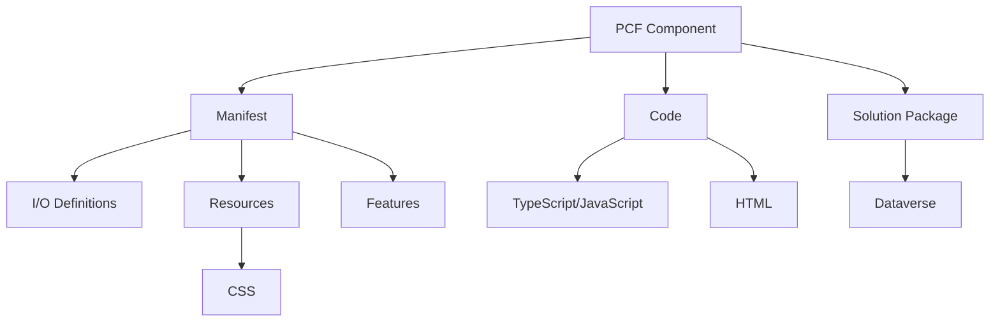

**Talking Points:**

--need to add brief intros for us both--

--Why the F would you even do this stuff--
- Scalability
- To hell with jQuery
- Good architecture/separation of concerns
- Better subgrid handling
- WebAPI access vs writing fetch by hand

Welcome, everyone! In this session, we’ll dive deep into the world of PowerApps Component Frameworks (PCFs) and their advanced applications within Power Pages. Whether you’re a developer, architect, or solution designer, you’ll gain a comprehensive understanding of how PCFs can elevate your Power Pages projects.

We’ll explore a range of advanced use cases, examining both the technical details and the strategic decisions behind each approach. You’ll see real-world examples, learn about the pros and cons of different techniques, and walk away with practical insights you can apply to your own solutions.

This is a hands-on, technical session—expect code samples, architectural diagrams, and candid discussions about what works (and what doesn’t) in the field. By the end, you’ll be equipped to make informed choices and push the boundaries of what’s possible with Power Pages and PCFs.

---

### 2 Basic Building & Packaging Strategies

#### 2.1 Virtual vs. Vanilla PCF

##### Virtual

Virtual components utilize the React and Fluent libraries within the platform to work. This leads to much smaller PCF bundles.

###### Vanilla (Standard)

Vanilla components do not include React by default. You can include React in a standard component, but it turns into a headache of version management pretty quickly.

##### Sample Code: Virtual PCF

**index.ts for virtual example**
```typescript
// Virtual PCF component
import { IInputs, IOutputs } from "./generated/ManifestTypes";
import { HelloWorld, IHelloWorldProps } from "./HelloWorld";
import * as React from "react";

export class virtualExample implements ComponentFramework.ReactControl<IInputs, IOutputs> {
    private notifyOutputChanged: () => void;

    constructor() {
        // Empty
    }

    public init(
        context: ComponentFramework.Context<IInputs>,
        notifyOutputChanged: () => void,
        state: ComponentFramework.Dictionary
    ): void {
        this.notifyOutputChanged = notifyOutputChanged;
    }

    public updateView(context: ComponentFramework.Context<IInputs>): React.ReactElement {
        const props: IHelloWorldProps = { name: 'Power Apps' };
        return React.createElement(
            HelloWorld, props
        );
    }

    public getOutputs(): IOutputs {
        return { };
    }

    public destroy(): void {
        // Add code to cleanup control if necessary
    }
}
```

**HelloWorld.tsx for virtual example**
```typescript
import * as React from 'react';
import { FluentProvider, Input, Label } from '@fluentui/react-components';

export interface IHelloWorldProps {
  name?: string;
}

export const HelloWorld: React.FC<IHelloWorldProps> = (props: IHelloWorldProps) => {
  const [text, setText] = React.useState<string>("");

    return (
      <FluentProvider>
        <Label size='large'>Input label for Fluent example</Label>
        <br />
        <Input appearance="outline" id="input1" type="text" onChange={(ev, data) => { setText(data.value) }} />
        <br />
        <Label>{text}</Label>
      </FluentProvider>
    )
}

```

##### Sample Code: Vanilla PCF

```typescript
// Vanilla PCF component
export class StandardControl implements ComponentFramework.StandardControl<IInputs, IOutputs> {
    private _container: HTMLDivElement;
    private _context: ComponentFramework.Context<IInputs>;
    private _notifyOutputChanged: () => void;
    private _value: string;
    
    public init(context: ComponentFramework.Context<IInputs>, notifyOutputChanged: () => void): void {
        this._context = context;
        this._notifyOutputChanged = notifyOutputChanged;
        this._container = document.createElement("div");
        
        // Create UI elements
        const input = document.createElement("input");
        input.type = "text";
        input.addEventListener("change", this._onInputChange);
        this._container.appendChild(input);
        
        // Add to parent container
        context.container.appendChild(this._container);
    }
    
    private _onInputChange = (event: Event): void => {
        this._value = (event.target as HTMLInputElement).value;
        this._notifyOutputChanged();
    }
    
    public updateView(context: ComponentFramework.Context<IInputs>): void {
        // Update UI based on context changes
    }
    
    public getOutputs(): IOutputs {
        return {
            value: this._value
        };
    }
    
    public destroy(): void {
        // Cleanup
    }
}
```

#### 2.2 Forcing React Bundling

- When we submitted the abstract for this presentation, it was necessary to force React into your virtual component bundle through "npm install --save react" in order to have it function on a Power Pages site
- However this no longer seems to be the case, an out of the box virtual component can function on Power Pages without bundling React of Fluent UI.

#### 2.3 Building for Power Pages

- As you don't have to force React or Fluent UI into your PCF bundle anymore, building PCF controls for Power Pages has become pretty easy.
- You can simply initialize your component, write your code, build to a Power Apps solution, and import as you would any other PCF.

## 3. Basic Integration Methods (8 minutes)

### 3.1 PCFs on Model-Driven App Forms and How to Use Those in Power Pages

In this example, a PCF is tied to a simple field on a model-driven app form in the Power Apps form editor.

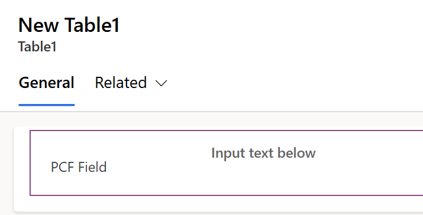

This is the relevant configuration for the PCF on the MDA form.


Once you're in the Power Pages editor, click the plus button within a section to add a component. That will bring up the following, and you'll click the Form option.

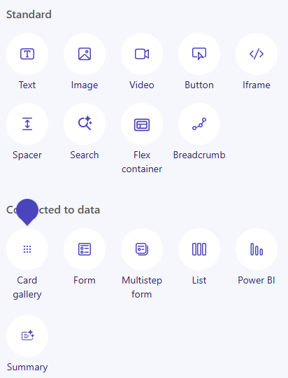

Clicking the Form option will bring up this dialog, you'll want to use New form.

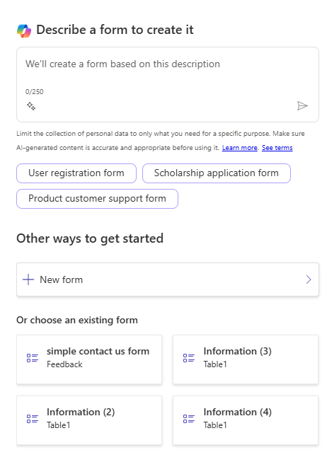

Which in turn will bring up this dialog. In our case for this example, we keep it fairly simple, we only need the Table, the Form, and a name for the Form within Power Pages.

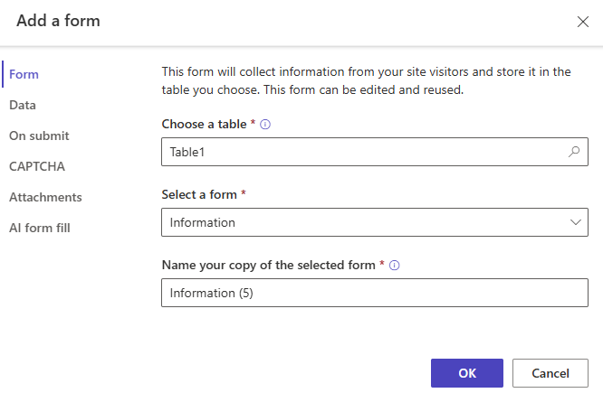

That makes the form available on your Power Pages site in the WYSIWYG editor. But you may notice that the field labeled PCF Field is just a simple text field, which doesn't look right.

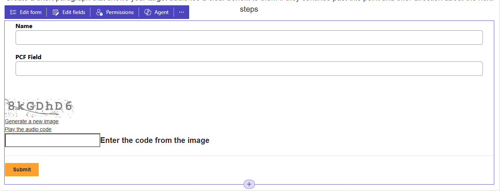

Click on the individual field and you'll be presented with these options. You need to enable the code component.

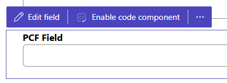

This is an example of the dialog that appears when you click Enable code component. Make any adjustments you may need to and click Done.

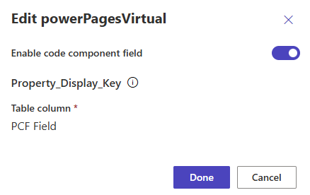

You will likely see this in place of the field you used for the code component. This doesn't mean there's an issue with your component, it just means that the WYSIWYG editor doesn't execute all the code necessary show your component.

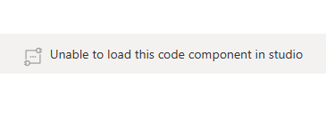

If you use the Preview button to look at your site, you should see your PCF as intended.

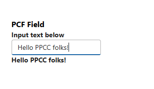

Our simple example takes the value from a text input and reactively displays that below the input.

### 3.2 Form Embedding with Liquid

Power Pages also uses the Liquid templating language behind the scenes, and devs can edit that code. There is a button in the WYSIWYG editor with the VS Code logo and label that reads "Edit code" that will take you to your site's code.

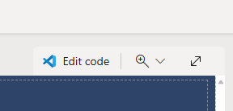

Once it loads, it should bring up the actual page you were on when you launched the editor. You can look through the onslaught of divs that comprises your page, and eventually find where your form is embedded.

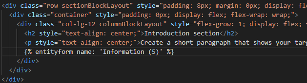

The code that embeds your form in the page will look something like this:

```

```

### 3.3 Limitations of Form Embedding
Embedding a full form in your Power Pages site does come with limitations however. Your PCF will be tied to whatever form it's on, and will always reflect the context of the form around it. A PCF embedded in a form cannot be separated from the form. But you can use the PCF on its own in a Power Pages site.

### 3.4 Embedding with Liquid Tagging
PCFs can be used on an individual basis on a Power Pages site through Liquid tags. The codecomponent Liquid tag works with PCFs to bring PCFs in to a page without needing the PCF to be embedded on a form.

To do this, you'll need the name of the PCF component, seen here in the Name column:
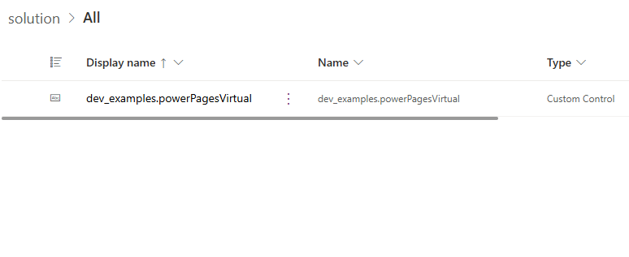

Then we'll embed it right below the form we embedded in the last example:
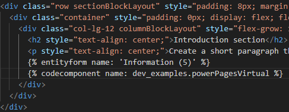

The code that embeds the PCF directly in Liquid will look something like this:
``

And if you need to provide a value to a property in your PCF, those are key/value pairs separated by a colon, like this:
``

Save the file in the code editor, then head back to the WYSIWYG editor and hit sync to make sure the changes from the code editor come through. And sure enough, it's there (seen below as the second "Unable to load this code component in studio" marker)!

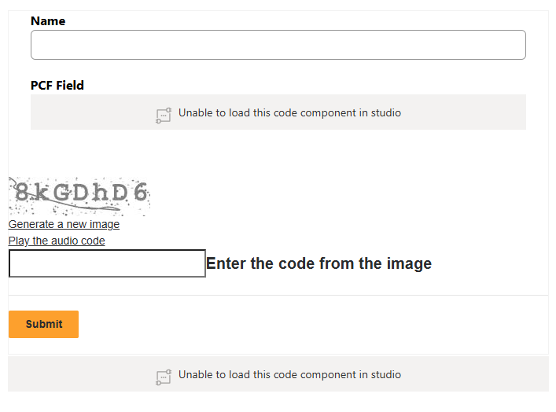

And here it is in the preview:

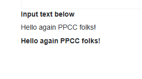

### 3.5 Limitations of Liquid Tag Embedding

- Data binding constraints/quirks
- Context limitations - DOES NOT WORK in Web Templates
---

## 4. UI Framework Considerations

#### 4.1 Fluent UI vs. Bootstrap

Fluent UI:
- Built by Microsoft
- Adopts similar design language to what already exists in Power Apps
- Integrated with Microsoft ecosystem
- Fluent components have issues in Liquid tagging

Bootstrap:
- Built by Twitter
- Platform-agnostic
- More broadly usable
- Power Pages uses Bootstrap internally

#### 4.2 Fluent UI implementations
Integrating Fluent UI is as easy as adding `--framework react` to your `pac pcf init` command. Using that parameter ensures that React and Fluent UI are bundled with your component and ready for you to use.

##### Sample Code: Fluent UI Implementation

**index.ts for Fluent example**
```typescript
import { IInputs, IOutputs } from "./generated/ManifestTypes";
import { HelloWorld, IHelloWorldProps } from "./HelloWorld";
import * as React from "react";

export class fluentExample implements ComponentFramework.ReactControl<IInputs, IOutputs> {
    private notifyOutputChanged: () => void;

    constructor() {
        // Empty
    }

    public init(
        context: ComponentFramework.Context<IInputs>,
        notifyOutputChanged: () => void,
        state: ComponentFramework.Dictionary
    ): void {
        this.notifyOutputChanged = notifyOutputChanged;
    }

    public updateView(context: ComponentFramework.Context<IInputs>): React.ReactElement {
        const props: IHelloWorldProps = { name: 'Power Apps' };
        return React.createElement(
            HelloWorld, props
        );
    }

    public getOutputs(): IOutputs {
        return { };
    }

    public destroy(): void {
        // Add code to cleanup control if necessary
    }
}
```

**HelloWorld.tsx for Fluent example**
```typescript
import * as React from 'react';
import { FluentProvider, Input, Label } from '@fluentui/react-components';

export interface IHelloWorldProps {
  name?: string;
}

export const HelloWorld: React.FC<IHelloWorldProps> = (props: IHelloWorldProps) => {
  const [text, setText] = React.useState<string>("");

    return (
      <FluentProvider>
        <Label size='large'>Input label for Fluent example</Label>
        <br />
        <Input appearance="outline" id="input1" type="text" onChange={(ev, data) => { setText(data.value) }} />
        <br />
        <Label>{text}</Label>
      </FluentProvider>
    )
}
```

#### 4.3 Bootstrap implementation
- You need to use `npm install bootstrap` to make sure your project includes Bootstrap
- Once that's done, you need to include it as a resource in ControlManifest.Input.xml

**resources section of ControlManifest.Input.xml for Bootstrap example**
```xml
<resources>
  <code path="index.ts" order="1"/>
  <css path="../node_modules/bootstrap/dist/css/bootstrap.min.css" order="1" />
</resources>
```

##### Sample Code: Bootstrap Implementation

**index.ts for Bootstrap example**

```typescript
// Bootstrap in PCF
import { IInputs, IOutputs } from "./generated/ManifestTypes";
import 'bootstrap';

export class bootstrapExample
  implements ComponentFramework.StandardControl<IInputs, IOutputs>
{
  constructor() {
    // Empty
  }

  public init(
    context: ComponentFramework.Context<IInputs>,
    notifyOutputChanged: () => void,
    state: ComponentFramework.Dictionary,
    container: HTMLDivElement
  ): void {
    // Add control initialization code
    const formLabel = document.createElement("label");
    const formInput = document.createElement("input");

    formInput.setAttribute("id", "bootstrapExampleInput1");
    formInput.setAttribute(
      "placeholder",
      "Placeholder text for Bootstrap input element"
    );
    formInput.setAttribute("type", "text");
    formInput.classList.add("form-control");

    formLabel.setAttribute("for", "bootstrapExampleInput1");
    formLabel.classList.add("form-label");
    formLabel.innerText = "Input label for Bootstrap example";

    container.appendChild(formLabel);
    container.appendChild(formInput);
  }

  public updateView(context: ComponentFramework.Context<IInputs>): void {
    // Add code to update control view
  }

  public getOutputs(): IOutputs {
    return {};
  }

  public destroy(): void {
    // Add code to cleanup control if necessary
  }
}
```

---

## 5. Advanced data management topics (10 minutes)

#### Sample Code: Advanced Data Access

The PCF WebAPI provides some helpful functions that cover basic use cases, but extended capabilities still need to be coded the old fashioned way...

```typescript
private associateRecordsWithReferences = async (entityReference: ComponentFramework.EntityReference, relationship: string, relatedEntityReference: ComponentFramework.EntityReference) => {
  if(relatedEntityReference.etn === undefined) {
      throw new Error("Related entity reference is not valid. an Entity Type Name must be provided.");
  }
  if(entityReference.etn === undefined) {
      throw new Error("Entity reference is not valid. an Entity Type Name must be provided.");
  }
  const payload = this.getWebAPIPathForEntityRecord(relatedEntityReference.etn, relatedEntityReference.id.guid) + "/" + relationship + "/$ref";
  
  const res = await window.fetch(
    await this.getWebAPIPathForEntityRecord(entityReference.etn, entityReference.id.guid) + "/" + relationship + "/$ref",
    this.options.post(payload)
  ).then((response) => {
      if (response.ok) {
          return response.json();
      } else {
          throw new Error("Error associating records");
      }
  });
    
  return res;
};
```

#### Sample Code: Cross-Component Communication //READY

```typescript
//initialize the control and the event bus
public init(
        context: ComponentFramework.Context<IInputs>,
        notifyOutputChanged: () => void,
        state: ComponentFramework.Dictionary
    ): void {
        this.notifyOutputChanged = notifyOutputChanged;
        
        // Create global event bus with consistent naming convention
        if (!(window as any).PCFEventBus) {
            (window as any).PCFEventBus = document.createElement('div');
            // Optional: Add some metadata for debugging
            (window as any).PCFEventBus.setAttribute('data-pcf-eventbus', 'true');
            console.log('PCF Event Bus initialized');
        }

        this.eventBus = (window as any).PCFEventBus;
    }
```

```typescript
  // Create and dispatch a custom event with test data
  const testValue = {
      message: "Hello from PCF EventPasser",
      timestamp: new Date().toISOString(),
      componentType: "PCF in Power Pages",
      sourceComponent: "EventPasserPCF"
  };
  
  const peerEvent = new CustomEvent('pcfPeerCommunication', {
      detail: testValue,
      bubbles: false
  });
  
  // Dispatch on the global event bus
  this.eventBus.dispatchEvent(peerEvent);
  
  this.notifyOutputChanged();
```

```typescript
  (window as any).PCFEventBus.addEventListener('pcfPeerCommunication', (event: CustomEvent) => {
    if (event.detail.sourceComponent !== 'EventPasserPCF') { // Avoid self-events
        console.log('Received peer event:', event.detail);
        count++;
        const countDiv = document.getElementById("eventCount");
        if (countDiv) {
            countDiv.innerText = "Event Count: " + count;
        }
    }
  });
```

### 5.2 Performance Optimization

- Lazy loading
- Debouncing 
- throttling

#### Sample Code: Performance Optimized PCF


---

## 6. Best Practices & Resources (3 minutes)

### 6.1 Development Best Practices

- Modular code structure
- Error handling and logging
- Performance considerations
- Testing strategies

### 6.2 Deployment Considerations

- Solution packaging
- Version management
- Environment-specific configurations

### 6.3 Troubleshooting Common Issues

- Browser console debugging
- Network request monitoring
- Performance profiling

### 6.4 Resources and Documentation

- Official Microsoft documentation
- Community resources
- Sample repositories
- Learning paths

---

## Conclusion

This presentation has covered advanced techniques for using PCFs in Power Pages applications, from basic integration methods to overcoming common limitations and implementing sophisticated UI/UX enhancements. By leveraging these techniques, developers can create rich, interactive, and high-performing components that enhance the user experience in Power Pages applications.

Remember that PCFs offer a powerful way to extend the capabilities of Power Pages beyond what's possible with out-of-the-box components, but they also require careful consideration of performance, security, and user experience factors.
