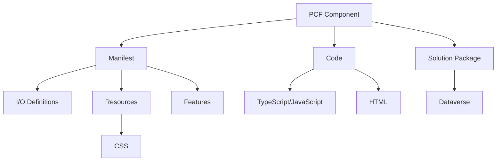

# Advanced PCFs for Power Pages

## Detailed Presentation Outline with Code Examples

---

## 1. Introduction to PCFs in Power Pages (3 minutes)

### 1.1 What are PCFs and Why Use Them in Power Pages?

**SLIDE:**

- Welcome and session objectives
- What are PCFs (PowerApps Component Frameworks) for Power Pages?
- Why advanced PCFs matter for Power Pages projects
- What to expect: technical depth, real-world scenarios, and practical takeaways
- Session roadmap



**Talking Points:**

--need to add brief intros for us both--

--Why the F would you even do this stuff--

Welcome, everyone! In this session, we’ll dive deep into the world of PowerApps Component Frameworks (PCFs) and their advanced applications within Power Pages. Whether you’re a developer, architect, or solution designer, you’ll gain a comprehensive understanding of how PCFs can elevate your Power Pages projects.

We’ll explore a range of advanced use cases, examining both the technical details and the strategic decisions behind each approach. You’ll see real-world examples, learn about the pros and cons of different techniques, and walk away with practical insights you can apply to your own solutions.

This is a hands-on, technical session—expect code samples, architectural diagrams, and candid discussions about what works (and what doesn’t) in the field. By the end, you’ll be equipped to make informed choices and push the boundaries of what’s possible with Power Pages and PCFs.

---

### 2 Basic Building & Packaging Strategies

#### 2.1 Virtual vs. Vanilla PCF

##### Virtual

Virtual components utilize the React and Fluent libraries within the platform to work. This leads to much smaller PCF bundles.

###### Vanilla (Standard)

Vanilla components do not include React by default. You can include React in a standard component, but it turns into a headache of version management pretty quickly.

##### Sample Code: Virtual PCF

```typescript
// Virtual PCF component
export class VirtualControl implements ComponentFramework.StandardControl<IInputs, IOutputs> {
    private _container: HTMLDivElement;
    private _context: ComponentFramework.Context<IInputs>;
    private _notifyOutputChanged: () => void;
    
    public init(context: ComponentFramework.Context<IInputs>, notifyOutputChanged: () => void): void {
        this._context = context;
        this._notifyOutputChanged = notifyOutputChanged;
        this._container = document.createElement("div");
        
        // Virtual controls don't have a direct visual representation
        // They typically manipulate other elements or provide services
    }
    
    public updateView(context: ComponentFramework.Context<IInputs>): void {
        // Update logic without direct UI manipulation
    }
    
    public getOutputs(): IOutputs {
        return {};
    }
    
    public destroy(): void {
        // Cleanup
    }
}
```

##### Sample Code: Vanilla PCF

```typescript
// Vanilla PCF component
export class StandardControl implements ComponentFramework.StandardControl<IInputs, IOutputs> {
    private _container: HTMLDivElement;
    private _context: ComponentFramework.Context<IInputs>;
    private _notifyOutputChanged: () => void;
    private _value: string;
    
    public init(context: ComponentFramework.Context<IInputs>, notifyOutputChanged: () => void): void {
        this._context = context;
        this._notifyOutputChanged = notifyOutputChanged;
        this._container = document.createElement("div");
        
        // Create UI elements
        const input = document.createElement("input");
        input.type = "text";
        input.addEventListener("change", this._onInputChange);
        this._container.appendChild(input);
        
        // Add to parent container
        context.container.appendChild(this._container);
    }
    
    private _onInputChange = (event: Event): void => {
        this._value = (event.target as HTMLInputElement).value;
        this._notifyOutputChanged();
    }
    
    public updateView(context: ComponentFramework.Context<IInputs>): void {
        // Update UI based on context changes
    }
    
    public getOutputs(): IOutputs {
        return {
            value: this._value
        };
    }
    
    public destroy(): void {
        // Cleanup
    }
}
```

#### 2.2 Forcing React Bundling

- When we submitted the abstract for this presentation, it was necessary to force React into your virtual component bundle through "npm install --save react" in order to have it function on a Power Pages site
- However this no longer seems to be the case, an out of the box virtual component can function on Power Pages without bundling React of Fluent UI.

#### 2.3 Building for Power Pages

- As you don't have to force React or Fluent UI into your PCF bundle anymore, building PCF controls for Power Pages has become pretty easy.
- You can simply initialize your component, write your code, build to a Power Apps solution, and import as you would any other PCF.

## 3. Basic Integration Methods (8 minutes)

### 3.1 PCFs on Model-Driven App Forms and How to Use Those in Power Pages

In this example, a PCF is tied to a simple field on a model-driven app form in the Power Apps form editor.


This is the relevant configuration for the PCF on the MDA form.


Once you're in the Power Pages editor, click the plus button within a section to add a component. That will bring up the following, and you'll click the Form option.


Clicking the Form option will bring up this dialog, you'll want to use New form.


Which in turn will bring up this dialog. In our case for this example, we keep it fairly simple, we only need the Table, the Form, and a name for the Form within Power Pages.


That makes the form available on your Power Pages site in the WYSIWYG editor. But you may notice that the field labeled PCF Field is just a simple text field, which doesn't look right.


Click on the individual field and you'll be presented with these options. You need to enable the code component.


This is an example of the dialog that appears when you click Enable code component. Make any adjustments you may need to and click Done.


You will likely see this in place of the field you used for the code component. This doesn't mean there's an issue with your component, it just means that the WYSIWYG editor doesn't execute all the code necessary show your component.


If you use the Preview button to look at your site, you should see your PCF as intended.


Our simple example takes the value from a text input and reactively displays that below the input.

### 3.2 Form Embedding with Liquid

Power Pages also uses the Liquid templating language behind the scenes, and devs can edit that code. There is a button in the WYSIWYG editor with the VS Code logo and label that reads "Edit code" that will take you to your site's code.


Once it loads, it should bring up the actual page you were on when you launched the editor. You can look through the onslaught of divs that comprises your page, and eventually find where your form is embedded.


The code that embeds your form in the page will look something like this:

```

```

### 3.3 Limitations of Form Embedding
Embedding a full form in your Power Pages site does come with limitations however. Your PCF will be tied to whatever form it's on, and will always reflect the context of the form around it. A PCF embedded in a form cannot be separated from the form. But you can use the PCF on its own in a Power Pages site.

### 3.4 Embedding with Liquid Tagging
PCFs can be used on an individual basis on a Power Pages site through Liquid tags. The codecomponent Liquid tag works with PCFs to bring PCFs in to a page without needing the PCF to be embedded on a form.

To do this, you'll need the name of the PCF component, seen here in the Name column:


Then we'll embed it right below the form we embedded in the last example:


Save the file in the code editor, then head back to the WYSIWYG editor and hit sync to make sure the changes from the code editor come through. And sure enough, it's there (seen below as the second "Unable to load this code component in studio" marker)!


And here it is in the preview:


### 3.5 Limitations of Liquid Tag Embedding

- Data binding constraints/quirks
- Context limitations - DOES NOT WORK in Web Templates

#### Sample Code: Liquid Tag Limitations

**THIS ISN'T REAL. COME UP WITH SOMETHING ELSE**

```html
{% pcf control="MyNamespace.MyControl" 
   data-property-dataset=entities.contact 
   width="100%" %}
   
<!-- The following would not work as expected -->
<!-- Cannot directly access current user context -->
<!-- data-property-currentuser=user -->
```

---

## 4. UI Framework Considerations

#### 4.1 Fluent UI vs. Bootstrap

- Comparison of frameworks
- Integration approaches

##### Sample Code: Fluent UI Implementation

**UPDATE THIS TO FLUENT 9 AND MAKE THIS MAKE SENSE**

```typescript
// Fluent UI in PCF
import * as React from 'react';
import * as ReactDOM from 'react-dom';
import { PrimaryButton, TextField, Stack, IStackTokens } from '@fluentui/react';

const stackTokens: IStackTokens = { childrenGap: 10 };

const FluentComponent: React.FC = () => {
  const [value, setValue] = React.useState("");
  
  return (
    <Stack tokens={stackTokens}>
      <TextField 
        label="Enter value" 
        value={value} 
        onChange={(e, newValue) => setValue(newValue || "")} 
      />
      <PrimaryButton 
        text="Submit" 
        onClick={() => console.log(value)} 
      />
    </Stack>
  );
};

export class FluentUIControl implements ComponentFramework.StandardControl<IInputs, IOutputs> {
  private _container: HTMLDivElement;
  
  public init(context: ComponentFramework.Context<IInputs>, notifyOutputChanged: () => void): void {
    this._container = document.createElement("div");
    context.container.appendChild(this._container);
    
    ReactDOM.render(<FluentComponent />, this._container);
  }
  
  // Other required methods...
}
```

##### Sample Code: Bootstrap Implementation

**SAME WEIRD COMPONENT IN COMPONENT STUFF - MAKE IT MAKE SENSE**

```typescript
// Bootstrap in PCF
import * as React from 'react';
import * as ReactDOM from 'react-dom';
import 'bootstrap/dist/css/bootstrap.min.css';

const BootstrapComponent: React.FC = () => {
  const [value, setValue] = React.useState("");
  
  return (
    <div className="container">
      <div className="form-group">
        <label htmlFor="inputValue">Enter value</label>
        <input 
          type="text" 
          className="form-control" 
          id="inputValue" 
          value={value} 
          onChange={(e) => setValue(e.target.value)} 
        />
      </div>
      <button 
        className="btn btn-primary" 
        onClick={() => console.log(value)}
      >
        Submit
      </button>
    </div>
  );
};

export class BootstrapControl implements ComponentFramework.StandardControl<IInputs, IOutputs> {
  private _container: HTMLDivElement;
  
  public init(context: ComponentFramework.Context<IInputs>, notifyOutputChanged: () => void): void {
    this._container = document.createElement("div");
    context.container.appendChild(this._container);
    
    ReactDOM.render(<BootstrapComponent />, this._container);
  }
  
  // Other required methods...
}
```

---

## 5. Overcoming Common Limitations (10 minutes)

### 5.1 Data Access & Integration Strategies

- Liquid-Embedded Fetch
- Working with WebAPI
- PostMessage API
- Custom events

#### Sample Code: Advanced Data Access

```typescript
// Advanced data access in PCF
export class DataAccessControl implements ComponentFramework.StandardControl<IInputs, IOutputs> {
  private _container: HTMLDivElement;
  private _context: ComponentFramework.Context<IInputs>;
  private _cache: Map<string, any> = new Map();
  
  public init(context: ComponentFramework.Context<IInputs>, notifyOutputChanged: () => void): void {
    this._context = context;
    this._container = document.createElement("div");
    context.container.appendChild(this._container);
    
    this._loadData();
  }
  
  private async _loadData(): Promise<void> {
    try {
      // Check cache first
      const cacheKey = "contacts_recent";
      if (this._cache.has(cacheKey)) {
        this._renderData(this._cache.get(cacheKey));
        return;
      }
      
      //Oh AI, you so crazy. Look here instead: https://learn.microsoft.com/en-us/power-apps/developer/data-platform/org-service/execute-multiple-requests

      // // Prepare batch request
      // const batch = {
      //   requests: [
      //     {
      //       id: "1",
      //       method: "GET",
      //       url: "contacts?$select=contactid,fullname,emailaddress1&$top=10&$orderby=createdon desc"
      //     },
      //     {
      //       id: "2",
      //       method: "GET",
      //       url: "accounts?$select=accountid,name&$top=5&$orderby=createdon desc"
      //     }
      //   ]
      // };
      
      // // Execute batch request
      // const response = await fetch(`${this._context.page.getClientUrl()}/api/data/v9.1/$batch`, {
      //   method: "POST",
      //   headers: {
      //     "Content-Type": "application/json",
      //     "Accept": "application/json",
      //     "OData-MaxVersion": "4.0",
      //     "OData-Version": "4.0"
      //   },
      //   body: JSON.stringify(batch)
      // });
      
      // const batchResponse = await response.json();
      
      // Process responses
      const contacts = batchResponse.responses[0].body.value;
      
      // Cache the results (with 5 minute expiration)
      this._cache.set(cacheKey, contacts);
      setTimeout(() => this._cache.delete(cacheKey), 5 * 60 * 1000);
      
      // Render the data
      this._renderData(contacts);
    } catch (error) {
      console.error("Error loading data:", error);
      this._container.innerHTML = `<div class="error">Error loading data</div>`;
    }
  }
  
  private _renderData(data: any[]): void {
    // Render the data...
  }
  
  // Other required methods...
}
```

#### Sample Code: Cross-Component Communication

```typescript
//simple example of writing and reading sessionstorage
sessionStorage.setItem("key", "value");
const value = sessionStorage.getItem("key");
```

```javascript
try {
  // Attempting to access window.parent can cause issues
  window.parent.postMessage({ type: "formData", data: formData }, "*");
} catch (e) {
  console.error("Cross-frame access denied:", e);
}
```

**this is good, but let's rework the demo to be easier to understand**

```typescript
// PCF communicating with other page elements
export class CommunicatingControl implements ComponentFramework.StandardControl<IInputs, IOutputs> {
  private _container: HTMLDivElement;
  private _context: ComponentFramework.Context<IInputs>;
  private _value: string;
  private _notifyOutputChanged: () => void;
  
  public init(context: ComponentFramework.Context<IInputs>, notifyOutputChanged: () => void): void {
    this._context = context;
    this._notifyOutputChanged = notifyOutputChanged;
    this._container = document.createElement("div");
    context.container.appendChild(this._container);
    
    // Create UI
    const button = document.createElement("button");
    button.textContent = "Send Message";
    button.addEventListener("click", this._sendMessage);
    this._container.appendChild(button);
    
    // Listen for messages from other components
    window.addEventListener("message", this._handleMessage);
    
    // Listen for custom events
    document.addEventListener("custom:dataUpdate", this._handleCustomEvent as EventListener);
  }
  
  private _sendMessage = (): void => {
    // Send message to parent window
    window.parent.postMessage({
      type: "PCF_DATA_UPDATE",
      data: { value: "Updated value" }
    }, "*");
    
    // Dispatch custom event
    const event = new CustomEvent("custom:pcfAction", {
      detail: { action: "update", value: "Updated value" },
      bubbles: true
    });
    this._container.dispatchEvent(event);
  }
  
  private _handleMessage = (event: MessageEvent): void => {
    // Process messages from other components
    if (event.data && event.data.type === "EXTERNAL_UPDATE") {
      this._value = event.data.value;
      this._notifyOutputChanged();
    }
  }
  
  private _handleCustomEvent = (event: CustomEvent): void => {
    // Process custom events
    if (event.detail && event.detail.action === "refresh") {
      // Handle refresh action
    }
  }
  
  // Other required methods...
}
```

### 5.2 Performance Optimization

- Lazy loading
- Virtualization
- Debouncing and throttling

#### Sample Code: Performance Optimized PCF

```typescript
//simple Fluent control demonstrating lazy loading & virtualization (dataset)
```

```typescript
// Performance optimized PCF
import * as React from 'react';
import * as ReactDOM from 'react-dom';

// Utility function for debouncing
const debounce = (fn: Function, delay: number) => {
  let timeoutId: number;
  return (...args: any[]) => {
    clearTimeout(timeoutId);
    timeoutId = window.setTimeout(() => fn(...args), delay);
  };
};

// Virtualized list component
const VirtualizedList: React.FC<{items: any[]}> = ({ items }) => {
  const [visibleRange, setVisibleRange] = React.useState({ start: 0, end: 20 });
  const containerRef = React.useRef<HTMLDivElement>(null);
  
  const updateVisibleRange = () => {
    if (!containerRef.current) return;
    
    const container = containerRef.current;
    const scrollTop = container.scrollTop;
    const height = container.clientHeight;
    
    // Assuming each item is 40px tall
    const itemHeight = 40;
    const visibleItems = Math.ceil(height / itemHeight);
    const buffer = Math.floor(visibleItems / 2);
    
    const start = Math.max(0, Math.floor(scrollTop / itemHeight) - buffer);
    const end = Math.min(items.length, start + visibleItems + buffer * 2);
    
    setVisibleRange({ start, end });
  };
  
  // Debounced scroll handler
  const handleScroll = React.useMemo(
    () => debounce(updateVisibleRange, 100),
    [items.length]
  );
  
  React.useEffect(() => {
    const container = containerRef.current;
    if (container) {
      container.addEventListener('scroll', handleScroll);
      updateVisibleRange();
      return () => container.removeEventListener('scroll', handleScroll);
    }
  }, [handleScroll]);
  
  // Calculate total height to maintain scrollbar
  const totalHeight = items.length * 40;
  
  // Calculate offset for visible items
  const offsetY = visibleRange.start * 40;
  
  return (
    <div 
      ref={containerRef}
      style={{ height: '400px', overflow: 'auto' }}
    >
      <div style={{ height: `${totalHeight}px`, position: 'relative' }}>
        <div style={{ position: 'absolute', top: `${offsetY}px`, width: '100%' }}>
          {items.slice(visibleRange.start, visibleRange.end).map((item, index) => (
            <div 
              key={visibleRange.start + index} 
              style={{ height: '40px', padding: '10px', borderBottom: '1px solid #eee' }}
            >
              {item.name}
            </div>
          ))}
        
        </div>
      </div>
    </div>
  );
};

export class OptimizedListControl implements ComponentFramework.StandardControl<IInputs, IOutputs> {
  private _container: HTMLDivElement;
  private _items: any[] = [];
  
  public init(context: ComponentFramework.Context<IInputs>, notifyOutputChanged: () => void): void {
    this._container = document.createElement("div");
    context.container.appendChild(this._container);
    
    // Generate sample data
    this._items = Array.from({ length: 10000 }, (_, i) => ({
      id: i,
      name: `Item ${i}`,
      description: `Description for item ${i}`
    }));
    
    this._renderControl();
  }
  
  private _renderControl(): void {
    ReactDOM.render(
      <VirtualizedList items={this._items} />,
      this._container
    );
  }
  
  // Other required methods...
}
```

---

### 5.3 Handling Page Events

- Lifecycle events
- DOM events

#### Sample Code: Page Event Handling

**some of this might be useful, but seems a little niche. Maybe work this in to other demo areas?**

```typescript
// PCF handling page events
export class PageEventControl implements ComponentFramework.StandardControl<IInputs, IOutputs> {
  private _container: HTMLDivElement;
  private _context: ComponentFramework.Context<IInputs>;
  
  public init(context: ComponentFramework.Context<IInputs>, notifyOutputChanged: () => void): void {
    this._context = context;
    this._container = document.createElement("div");
    context.container.appendChild(this._container);
    
    // Listen for page visibility changes
    document.addEventListener("visibilitychange", this._handleVisibilityChange);
    
    // Listen for page resize
    window.addEventListener("resize", this._handleResize);
    
    // Listen for beforeunload
    window.addEventListener("beforeunload", this._handleBeforeUnload);
  }
  
  private _handleVisibilityChange = (): void => {
    if (document.hidden) {
      // Page is hidden (user switched tabs, minimized window, etc.)
      this._pauseOperations();
    } else {
      // Page is visible again
      this._resumeOperations();
    }
  }
  
  private _handleResize = (): void => {
    // Adjust layout based on new window size
    this._adjustLayout();
  }
  
  private _handleBeforeUnload = (event: BeforeUnloadEvent): void => {
    // Check if there are unsaved changes
    if (this._hasUnsavedChanges()) {
      // Show confirmation dialog
      event.preventDefault();
      event.returnValue = "You have unsaved changes. Are you sure you want to leave?";
    }
  }
  
  private _pauseOperations(): void {
    // Pause timers, animations, etc.
  }
  
  private _resumeOperations(): void {
    // Resume operations
  }
  
  private _adjustLayout(): void {
    // Adjust layout based on window size
  }
  
  private _hasUnsavedChanges(): boolean {
    // Check for unsaved changes
    return false;
  }
  
  public destroy(): void {
    // Remove event listeners
    document.removeEventListener("visibilitychange", this._handleVisibilityChange);
    window.removeEventListener("resize", this._handleResize);
    window.removeEventListener("beforeunload", this._handleBeforeUnload);
  }
  
  // Other required methods...
}
```

## 6. Best Practices & Resources (3 minutes)

### 6.1 Development Best Practices

- Modular code structure
- Error handling and logging
- Performance considerations
- Testing strategies

### 6.2 Deployment Considerations

- Solution packaging
- Version management
- Environment-specific configurations

### 6.3 Troubleshooting Common Issues

- Browser console debugging
- Network request monitoring
- Performance profiling

### 6.4 Resources and Documentation

- Official Microsoft documentation
- Community resources
- Sample repositories
- Learning paths

---

## Conclusion

This presentation has covered advanced techniques for using PCFs in Power Pages applications, from basic integration methods to overcoming common limitations and implementing sophisticated UI/UX enhancements. By leveraging these techniques, developers can create rich, interactive, and high-performing components that enhance the user experience in Power Pages applications.

Remember that PCFs offer a powerful way to extend the capabilities of Power Pages beyond what's possible with out-of-the-box components, but they also require careful consideration of performance, security, and user experience factors.